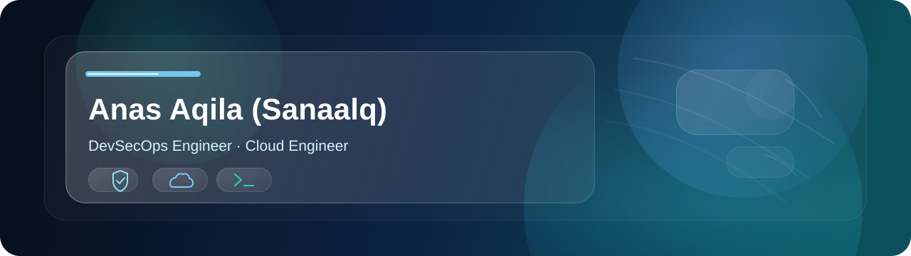

# 

  🔒 DevSecOps Engineer | ☁️ Cloud Engineer | 🐧 Linux &amp; Automation | 🛡️ Security Enthusiast

  
  

> ⚠️ Ganti badge Portfolio di atas begitu link-nya sudah ada — lihat bagian **Cara Pasang** di bawah untuk tahu baris mana yang perlu diedit.

## Tech Stack

  
  
  
  
  
  
  
  
  
  
  
  
  
  
  

### Security &amp; Monitoring

  
  
  
  
  
  
  

## Currently Learning

  ☁️ AWS (Solutions Architect track) | ☁️ Google Cloud Platform

## Currently Building

Building secure, automated infrastructure pipelines — integrating security scanning and policy checks directly into CI/CD, with a focus on cloud-native deployments on AWS and GCP.

## Security Fundamentals

  🐉 Kali Linux | 🌐 Network Security | 🔍 Vulnerability Assessment | 📦 Container Security | 🔑 IAM &amp; Secrets Management

## GitHub Statistics

  

  <picture>
    <source media="(prefers-color-scheme: dark)" srcset="https://raw.githubusercontent.com/Sanaalq/Sanaalq/output/pacman-contribution-graph-dark.svg" />
    <source media="(prefers-color-scheme: light)" srcset="https://raw.githubusercontent.com/Sanaalq/Sanaalq/output/pacman-contribution-graph.svg" />
    
  </picture>

